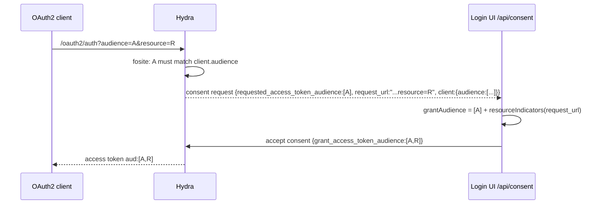

## Context

Branch `IAM-2324` adds `pkg/extra/resource.go` and `Service.grantAudience` in `pkg/extra/service.go`. On `GET /api/consent`, `handleConsent` (`pkg/extra/handlers.go`) fetches the consent request from Hydra, and `Service.AcceptConsent` sends `grant_access_token_audience = requested_access_token_audience + valid resource indicators` to `AcceptOAuth2ConsentRequest`. Nothing compares the indicators with the client's registered `audience`.

Control flow today:



`R` is granted regardless of `client.audience`. Hydra's consent handler applies `flow.GrantedAudience` without validation (`oauth2/handler.go` `updateSessionWithRequest`), so the Login UI is the only enforcement point.

Constraints:
- `hydra-client-go/v26` already returns `OAuth2ConsentRequest.Client.Audience`; no extra Hydra round trip is needed.
- `github.com/ory/fosite` is not a dependency and must not become one for a 30-line rule.
- Repo rules: services do not log errors (debug-level diagnostics are already used in `pkg/extra/service.go`), interfaces stay in `interfaces.go`, gomock tests, no testify.

## Goals / Non-Goals

**Goals:**
- Hold `resource` to the same authorization rule fosite applies to `audience`: the client's registered `audience` is the whitelist.
- Keep `/api/consent` failure semantics, logging style and the `AcceptConsent` signature unchanged.
- Make the rule testable in isolation and provable against a live Hydra.

**Non-Goals:**
- `invalid_target` rejection, caps on indicator count/length, JAR/PAR/device-flow recovery, DCR hardening (see proposal).
- Configurable matching strategy. Hydra hardcodes `fosite.DefaultAudienceMatchingStrategy`; so do we.

## Decisions

### D1: Filter in `Service.grantAudience`, not in the handler
`grantAudience` already has the consent request, which carries `Client.Audience`. Filtering there keeps `ServiceInterface.AcceptConsent` unchanged (no mock regeneration, no handler test churn) and keeps one function responsible for the granted audience. Alternative: compute the audience in `handleConsent` next to `resolveTenantID` and pass it in — rejected because it widens the service interface for no behavioural gain and splits audience logic across two files.

### D2: Reimplement fosite's rule locally, stricter on opaque URIs
New helper in `pkg/extra/resource.go`:

```go
// permittedResources returns the indicators the registered audience allows.
func permittedResources(registered, resources []string) (permitted, rejected []string)
func audiencePermits(registered, resource string) bool
```

`audiencePermits` mirrors `fosite.DefaultAudienceMatchingStrategy` (`audience_strategy.go:15-49`): parse both; equal scheme and host; indicator path equals the registered path, or equals it with trailing slashes trimmed, or extends it past a `/` boundary. Two deliberate deviations:
- `Opaque` must also be equal. fosite compares only scheme/host/path, so `urn:example:a` registered would permit every `urn:` indicator (`url.Parse` puts the body in `Opaque`, leaving `Path` empty). Being stricter than fosite is safe; being equal would be a hole.
- A registered entry that fails to parse is skipped rather than failing the whole request. fosite returns an error there because it runs at request validation time; at consent time we only decide what to grant.

Alternatives: exact string match (`fosite.ExactAudienceMatchingStrategy`) — simpler, but diverges from what the `audience` parameter gets on the same Hydra, so a registered `https://api.example` would accept `audience=https://api.example/v1` and reject `resource=https://api.example/v1`; confusing for operators. Importing fosite — rejected per constraints.

### D3: Rejected indicators join the existing `invalid` bucket
`grantAudience` becomes:

```go
audience := consent.GetRequestedAccessTokenAudience()
resources, invalid := resourceIndicators(consent.GetRequestUrl())
permitted, rejected := permittedResources(consent.GetClient().GetAudience(), resources)
// one Debugf for invalid, one for rejected — different causes, different messages
return mergeAudience(audience, permitted)
```

Two separate debug lines rather than one merged slice, so an operator can tell "malformed" from "not registered" without reading code. `consent.GetClient()` is nil-safe in the generated client (returns zero `OAuth2Client`, whose `GetAudience()` is nil), so a consent request without a client yields an empty whitelist and no grant.

### D4: Preserve ordering and dedupe semantics
`mergeAudience` is unchanged: requested audience first, permitted resources appended in request order, string-equal duplicates skipped. No normalisation (case, trailing slash) is applied to granted values — RFC 8707 section 2 allows the AS to use the value as sent, and JWT `aud` comparison is byte-wise.

## Risks / Trade-offs

- [Operators must register audiences before `resource` works] → README states the rule and the `hydra create client --audience` flag; issue #966 gets a comment. This is the intended posture.
- [DCR clients can self-register `audience`, so the whitelist is client-controlled where DCR is on] → Hydra behaviour, identical for the `audience` parameter today; documented in the proposal non-goals. Operators enabling DCR own that risk.
- [Rule drift if fosite changes its strategy] → the helper's doc comment cites the fosite function and version; the unit table pins the boundaries (`/v1` vs `/v10`, trailing slash, opaque URIs) so drift is visible.
- [Path-prefix permissiveness: registering `https://api.example` permits every path under it] → same as fosite; operators who want exact binding register the full path.
- [Silent drop hides misconfiguration] → debug log names the dropped value and the reason; the README tells operators where to look.

## Migration Plan

Single deploy, no data migration. Applies on top of the unmerged `IAM-2324` commits before the PR opens, so no released behaviour changes. Rollback: revert the commit; the branch then returns to the unrestricted grant, which must not ship.

## Observability

- Debug log lines: `dropping invalid resource indicators: [...]` (existing) and `dropping resource indicators not registered as client audience: [...]` (new). No new metrics; the existing `hydra.OAuth2API.AcceptOAuth2ConsentRequest` span is unchanged.

## Failure handling

- Unparseable registered audience entry: skipped, does not block other entries.
- No client on the consent request, or client with empty `audience`: nothing permitted, consent still accepted with Hydra's requested audience.
- All indicators rejected: consent accepted with Hydra's requested audience, same as a request with no `resource`.

## Open Questions

None. Matching strategy, log placement and failure semantics were decided in review (options 1–3; option 2 chosen).
