## Context

The repository produces an OCI container rock packaging a Go binary (`identity-platform-login-ui`) and frontend assets on top of a bare Ubuntu 22.04 chisel base. Releases are cut automatically by Google's `release-please` action upon merging a release PR into `main`.

Currently, `ci.yaml` triggers on tag push and invokes `canonical/identity-team/.github/workflows/_rock-gh-publish.yaml`, which pushes the container image tagged as `stable` and `${{ github.ref_name }}` before invoking `_rock-scan.yaml`. Furthermore, `_rock-scan.yaml` does not enforce exit code failure on detected CVEs. As a result, images with critical security vulnerabilities can be publicly stamped as `stable`. In parallel, pull request builds run full container image builds on every push, even if newly added Go dependencies contain known CVEs.

## Goals / Non-Goals

**Goals:**
- Eliminate the window where vulnerable images are published under the `stable` tag.
- Implement an automated release quarantine pattern using GitHub pre-releases and candidate container tags.
- Provide fast-failing vulnerability feedback on PRs via `govulncheck` before heavy container builds run.
- Enable periodic scheduled scans of the published stable image.
- Document and provide a clear upstream contract for `canonical/identity-team` reusable workflows.

**Non-Goals:**
- Removing container testing from PR verification entirely (rock builds still run on PRs, but strictly after tests and vulnerability checks pass).
- Automatically pinning or rewriting vulnerable transitive dependencies.

## Architecture & Pipeline Flow

```mermaid
flowchart TD
    subgraph PR["Pull Request Flow"]
        PR_Start[PR Opened / Updated] --> UnitTest[job: unit-test\nmake vet\nmake govulncheck\nmake test]
        UnitTest -->|Pass| RockBuild[job: build\n_rock-build.yaml]
        UnitTest -->|Vuln Found| PR_Fail[Job Fails Early\nRock build skipped]
    end

    subgraph Release["Release & Promotion Flow"]
        RP_Merge[Release PR Merged to main] --> RP_Cut[release-please\nprerelease: true]
        RP_Cut --> TagPush[Git Tag Created\nvX.Y.Z]
        TagPush --> RelBuild[job: build\nbuild rock artifact]
        RelBuild --> CandPublish[job: gh-publish-candidate\nPush to GHCR as :vX.Y.Z-candidate]
        CandPublish --> SecScan[job: scan\n_rock-scan.yaml with exit-code: 1]
        SecScan -->|Pass| Promote[job: promote\n1. Skopeo copy :vX.Y.Z-candidate -> :stable, :vX.Y.Z\n2. gh release edit vX.Y.Z --prerelease=false --latest]
        SecScan -->|Fail| Quarantined[Release Quarantined\nRemains Pre-release\nstable tag untouched]
    end

    subgraph Monitoring["Scheduled Monitoring"]
        Cron[Scheduled Cron] --> ScanStable[Scan ghcr.io/...:stable with Trivy]
        Cron --> VulnMain[Run govulncheck on main branch]
    end
```

## Decisions

### Decision 1: Use `prerelease: true` in `release-please-config.json`
- **Choice**: Configure `"prerelease": true` on the root package in [release-please-config.json](release-please-config.json).
- **Rationale**: When release-please creates the GitHub Release, it is flagged as `Pre-release`. GitHub does not set it as the latest release, signaling to downstream consumers and automation that it is not yet GA.
- **Alternatives Considered**:
  - *`draft: true`*: Draft releases do not trigger tag push events reliably and hide the release notes from collaborators.
  - *SemVer suffix (`v1.5.0-rc.1`)*: Requires a two-stage release PR cycle in release-please, creating unnecessary friction for service deployments.

### Decision 2: Embed `govulncheck` in `Makefile` and enforce `needs: [unit-test]` for `build`
- **Choice**:
  1. Add a `govulncheck` target in [Makefile](Makefile) executing `govulncheck` directly with `vendor` prerequisite.
  2. Call `make govulncheck` in [.github/workflows/unittest.yaml](.github/workflows/unittest.yaml).
  3. Update `build` in [.github/workflows/ci.yaml](.github/workflows/ci.yaml) to declare `needs: [unit-test]`.
- **Rationale**: `govulncheck` runs in seconds, analyzing actual AST reachability of vulnerable symbols. If a PR introduces an exploitable dependency, the pipeline fails immediately before allocating large self-hosted runner resources for `_rock-build.yaml`.
- **Alternatives Considered**:
  - *Scanning only during container rock build*: Fails too late in the development cycle, wasting 10-15 minutes of runner time per build.

### Decision 3: Candidate image tagging and promotion via Skopeo
- **Choice**: On tag triggers, publish the built rock to GHCR with a candidate tag (e.g. `${{ github.ref_name }}-candidate`). Run `_rock-scan.yaml` against this image. Upon scan success, run a promotion job that copies the image tags to `${{ github.ref_name }}` and `stable` using `skopeo copy`, then marks the release stable with `gh release edit <tag> --prerelease=false --latest`.
- **Rationale**: Keeps candidate layers already in the registry, allowing promotion to be an instantaneous OCI metadata copy without rebuilding or re-uploading layers.
- **Alternatives Considered**:
  - *Scanning purely inside the GitHub Actions runner without pushing*: Trivy would scan the local tarball, but publishing would still need to occur sequentially after, and remote registry vulnerability scanners (such as Canonical OCI Factory) benefit from evaluating registry manifests directly.

## Upstream Interface Requirements (`canonical/identity-team`)

To support this pattern without duplicating logic across repositories, two enhancements are needed in `canonical/identity-team`:

1. **`_rock-gh-publish.yaml`**:
   - Add input: `candidate: boolean` (default: `false`).
   - When `candidate: true`: tag the image as `${{ github.ref_name }}-candidate` and `${{ github.sha }}` instead of `stable` and `${{ github.ref_name }}`.
2. **`_rock-scan.yaml`**:
   - Add inputs: `exit-code: string` (default: `"1"`), `severity: string` (default: `"HIGH,CRITICAL"`), and `ignore-unfixed: boolean` (default: `true`).
   - Pass these inputs to `aquasecurity/trivy-action` so that presence of un-triaged vulnerabilities fails the calling workflow.
3. **`_rock-promote.yaml` (New Reusable Workflow)**:
   - Inputs: `candidate-image`, `target-tags` (e.g. `["stable", "${{ github.ref_name }}"]`), `release-tag`.
   - Executes `skopeo copy` to apply release tags and calls `gh release edit ${{ inputs.release-tag }} --prerelease=false --latest`.

## Risks / Trade-offs

- **[Risk] Upstream identity-team workflow latency** $\rightarrow$ *Mitigation*: While identity-team changes are in review, `identity-platform-login-ui` can execute the candidate tag and `skopeo copy` promotion steps directly in `ci.yaml` jobs using standard GH actions (`docker/login-action`, `rockcraft.skopeo`).
- **[Risk] False positives in `govulncheck`** $\rightarrow$ *Mitigation*: Unlike standard scanners, `govulncheck` verifies call-graph reachability. If an unfixable false positive occurs, standard Go vulnerability flags or explicit vendoring overrides can be documented.
- **[Risk] Release-please PR auto-merge vs quarantine** $\rightarrow$ *Mitigation*: `release.yaml` reopens/merges release PRs when ready; the pre-release flag is applied by release-please when creating the release object, so PR merge automation is unaffected.

## Security & Performance Considerations

- **Security**: Complete prevention of vulnerable images from reaching the `stable` registry tag. Any failure in the security scan halts the promotion pipeline automatically.
- **Performance**: Shifting `govulncheck` before rock build saves an average of 10–15 minutes of self-hosted runner time on pull requests that fail dependency checks.
- **Observability**: Scheduled scans output SARIF reports directly into the GitHub repository "Security > Code scanning" tab.
