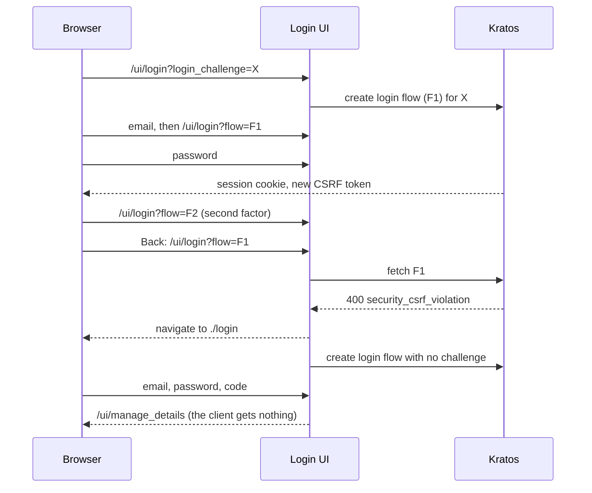

## Context

The login page (`ui/pages/login.tsx`) serves every step of a login. On a URL with `login_challenge` and no `flow` it creates a flow (`GET /api/kratos/self-service/login/browser?login_challenge=…`); on a URL with `flow` it fetches that flow (`GET /api/kratos/self-service/login/flows?id=…`). When a fetch or an update fails with an error that means the flow can no longer be used, `ui/util/handleFlowError.ts` starts a new one by navigating to the URL `newFlowUrl` returns.

Control flow of issue #984 before this change:

Two things are missing: the URL that Back returns to does not carry `X`, and the restart does not look for it.

Where the URL of a later step comes from:
- after the email: Kratos answers the identifier-first submission with a redirect to its `ui_url` with only the flow id (ory/kratos v25.4.0 `selfservice/strategy/idfirst/strategy_login.go`);
- after a tenant selection: `loginURL` in `pkg/tenants/handlers.go` builds `/ui/login?flow=<id>`;
- for the second factor: `handleCreateFlow` in `pkg/kratos/handlers.go` redirects to `/ui/login?flow=<id>`.

Every flow the frontend receives for a client's login carries the challenge as `oauth2_login_challenge`: Kratos sets it when the backend passes it the challenge (`CreateBrowserLoginFlow` in `pkg/kratos/service.go`, with `OIDC_WEBAUTHN_SEQUENCING_ENABLED` and `MULTI_TENANCY_ENABLED` both off), and `hydrateKratosLoginFlow` derives it from the flow's `return_to` otherwise. Second-factor flows have it too, because Kratos copies `return_to` and `login_challenge` onto the redirect to the second factor (ory/kratos v25.4.0 `session/manager.go`).

Constraints:
- Frontend only. `handleCreateFlow` and `handleUpdateFlow` decide between skipping, accepting and re-authenticating from three systems at once and are easy to break; nothing there needs to change.
- No new stored state: no cookie, no browser storage.

## Goals / Non-Goals

**Goals:**
- One place makes every login step carry the challenge, whatever led to the step.
- A restart reuses the challenge only when it makes sense to.
- The outcomes of a restart for a request that can no longer be completed are stated, not left implicit.

**Non-Goals:**
- Detecting a completed challenge, a page for an expired request, keeping `return_to` on a restart, other flow types (see proposal).

## Decisions

### D1: The login page copies the flow's challenge into its URL
After `getLoginFlow` resolves, `login.tsx` adds `oauth2_login_challenge` to the URL as `login_challenge` when the URL has none, with the shallow `router.replace` the page already uses to add `flow` after creating a flow. One place covers the step after the email, the password step reached from the tenant selection, and the second-factor step.

Alternatives:
- Rewrite the URL the email step redirects to. This was the first version of the change. It misses the tenant selection and the second factor, and it edits a URL the backend supplied.
- Have the backend add the challenge to every `/ui/login?flow=` URL it emits. Unit-testable in Go, but it touches three handlers, and Kratos's own redirect after the email still has to be patched in the frontend.

### D2: A restart keeps the challenge only when the URL names a flow
`newFlowUrl("login")` returns `./login?login_challenge=<challenge>` when the current URL has both `login_challenge` and `flow`, and `./login` otherwise.

A URL with a challenge and no flow is a flow that is being created. If the creation fails with an error that `handleFlowError` answers with a restart (`self_service_flow_return_to_forbidden`), restarting with the challenge loads the same URL and fails the same way, forever. Without the challenge the page falls back to a login with no client, as it did before this change.

Only `login_challenge` is kept. The other parameters of a stale login URL (`flow`, `email`, `invalid_method`, …) belong to the flow that is gone.

### D3: A restart for a request Hydra no longer completes is not special-cased
A restart is the same request to the backend as opening `/ui/login?login_challenge=<challenge>`. What happens next depends on the state of the challenge at Hydra, and the Login UI cannot learn that state up front: in Hydra v25.4.0 the challenge is the encoded flow as it was minted, so `GET /admin/oauth2/auth/requests/login` answers 200 and an accept succeeds again for a login that already completed (ory/hydra v25.4.0 `consent/handler.go` `getOAuth2LoginRequest`, `flow/flow_encoding.go`). The replay is refused only when the consent verifier is redeemed.

Accepted outcomes:
- **Completed login.** The user signs in again and the client is called back with `access_denied`, "The consent verifier has already been used". For an account without a second factor this is one Back press from the client.
- **Expired challenge** (Hydra's login request lifetime, 30 minutes by default). Where Kratos is given the challenge, it asks Hydra when the flow is created, the creation fails, and the error page is shown. Where it is not, nothing checks the challenge until the backend accepts the login request after the credentials, which fails with "failed to accept login request" on the login page; a login that outlives its challenge already ends this way without a restart.

Alternative: remember accepted challenges (a marker in the state cookie, set where the backend or Kratos accepts the login request) and answer a restart for one of them with "already signed in". It is the only way to tell the two states apart and it changes `handleCreateFlow`; it is left for a change of its own.

## Risks / Trade-offs

- [After a completed login, Back and a second sign-in end with an error at the client instead of on the account page] → Accepted. The client's request is what the user was signing in for; ending on the account page hid that the request was lost.
- [The challenge is in the URL of every login step, including the one that shows the buttons of external identity providers] → It was already in the URL of the first step. The UI sets no `Referrer-Policy`; browsers' default sends only the origin across sites. Setting `Referrer-Policy` on `/ui/*` is a separate hardening.
- [The extra `router.replace` runs while the user may already be typing] → It is a shallow replace of the query only, the same call the page already makes right after creating a flow, when the user may be typing their email. The Playwright specs type the password as soon as the field shows.
- [`oauth2_login_challenge` missing from a flow] → The URL is left unchanged and the step behaves as before this change.

## Migration Plan

Frontend only, no configuration, no data. Deploying the new static bundle is enough; rolling back restores the previous behaviour. A browser that loaded a login step with the old bundle keeps a URL without the challenge and restarts as before.

## Observability

No new log, metric or trace. In the backend's request log a restart that keeps the client's login shows as a 400 on `GET /api/kratos/self-service/login/flows?id=…` followed by `GET /api/kratos/self-service/login/browser?…login_challenge=…`; a restart that loses it showed the same 400 followed by a flow creation with `return_to` and no challenge.

## Failure handling

- Flow fetch fails with an error `handleFlowError` restarts on, URL has flow and challenge: restart for the challenge (D2).
- Flow creation fails with such an error: restart without the challenge (D2).
- Any other failure: unchanged, the error page.
- `router.replace` rejects: the rejection reaches the existing `.catch` chain of the fetch, which ends on the error page, as a rejection of the same call does after a flow creation.

## Open Questions

- None for this change. Whether to remember accepted challenges (D3) is a follow-up decision.
