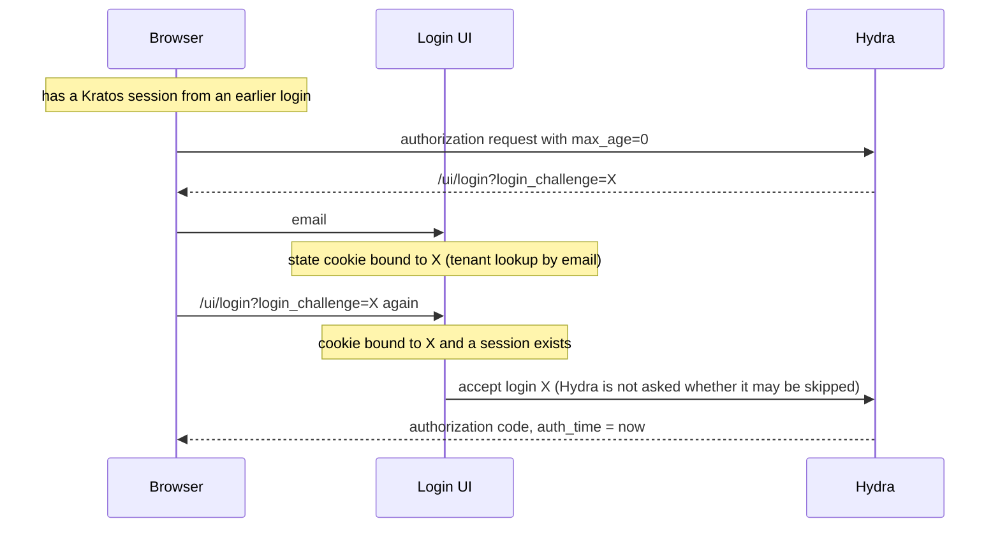

## Context

With multi-tenancy enabled, the tenant of a login is recorded in the state cookie (`internal/cookies` `FlowStateCookie`), bound to the login challenge by its hash. `CookieTenantResolver.InterceptLogin` (`pkg/tenants/resolver.go`) tells `handleCreateFlow` (`pkg/kratos/handlers.go`) what to do when the login page is opened with a session.

Control flow of issue #988 before this change:

The handler's comment gave the reason for not asking Hydra: "the user already completed auth for this challenge". The cookie cannot say that. It is bound to the challenge by `checkTenantSelectionByEmail` at the email step, by `StoreTenant` (`POST /api/v0/auth/tenant`), by `handleUpdateFlow` before the browser leaves for an external provider, and by the verification redirect of a reused session.

A second shortcut is in `MustReAuthenticate` (`pkg/kratos/service.go`): when the cookie is bound to the challenge and carries a setup flag (`TotpSetup`, `WebauthnSetup`, `BackupCodeUsed`), it answers that no sign-in is needed, without asking Hydra.

With multi-tenancy disabled `InterceptLogin` returns nothing, and the handler goes through `MustReAuthenticate` for every session.

## Goals / Non-Goals

**Goals:**
- A session is accepted without asking Hydra only on evidence that it signed in after the login for the challenge started.
- Every other session is handled the way a session from a previous flow already was.
- No new state outside the state cookie, and no clock of the Login UI in the comparison.

**Non-Goals:**
- Tying a session to the flow that created it. Kratos does not expose that link to the Login UI.
- Changing what `MustReAuthenticate` does with a setup flag.

## Decisions

### D1: The evidence is two times stamped by Kratos

The cookie records `LoginStartedAt`, the `issued_at` of a Kratos login flow submitted for the challenge. A session is signed in for the challenge when the cookie is bound to it, has a start, and the session's `authenticated_at` is later (`FlowStateCookie.SignedInFor`). Kratos sets `authenticated_at` only when a login, registration or recovery activates the session (ory/kratos v25.4.0 `session/manager_http.go:479`).

Alternative considered: a flag the Login UI sets when a submission succeeds. A sign-in through an external provider completes at Kratos, on the provider's callback, and the Login UI never handles its success; the session's `authenticated_at` covers it.

### D2: The start is recorded where a login flow is submitted

`handleUpdateFlow` already renewed the cookie for the flow's challenge after a submission Kratos took. It now calls `StartLogin` there, which keeps the first start recorded for a challenge, so that the second factor's flow cannot move the start past the first factor's sign-in. The email step (`handleUpdateIdentifierFirstFlow`) does not record a start: no credential is given there.

### D3: A session that did not sign in is a reused session

For such a session `InterceptLogin` returns `DeferMFAChecks`, as it did for a cookie bound to another challenge: the handler asks `MustReAuthenticate`, and honours the tenant selection or the accept only if Hydra allows the login to be skipped. The cookie is renewed for the challenge first, which keeps a tenant selected for it and drops the setup flags, and the handler passes that cookie to `MustReAuthenticate`. A flag set for the challenge by someone else's sign-in can therefore not vouch for the session.

### D4: The tenant selection endpoint renews the cookie

`StoreTenant` used to set the challenge hash and the tenant on whatever cookie the request carried, so the start and the flags of another challenge moved to the new one. It now starts from `RenewForChallenge`.

## Risks / Trade-offs

- **The evidence is a time.** A sign-in made elsewhere in the same browser after the login started counts as a sign-in for it. → Stated in the spec. It needs the user's own credentials, entered after the client asked.
- **A session created between the email step and the first credential is not signed in.** A password reset started from the password step returns to the login with the session of the recovery, and is shown the sign-in form. → Accepted: it is what happens with multi-tenancy disabled, and a recovery by email is not the sign-in the client asked for.
- **A login in progress across the deploy has no start.** → It is asked to sign in once more if it returns from a detour. The cookie lives five minutes by default (`COOKIE_TTL`).
- **One more request to Hydra** for a reused session of a user with several tenants, after the tenant page.

## Migration Plan

No migration. The new cookie field is optional, and a cookie without it fails safe. Rolling back removes the field's reader; cookies that carry it stay readable.

## Observability

No new metric or log line. The extra Hydra request is traced as `kratos.Service.MustReAuthenticate`.

## Failure handling

- Hydra cannot be reached when it is asked: the handler answers 500, as it does today for a reused session.
- The session has no `authenticated_at`: it is not signed in for the challenge, and Hydra decides.

## Open Questions

None.
