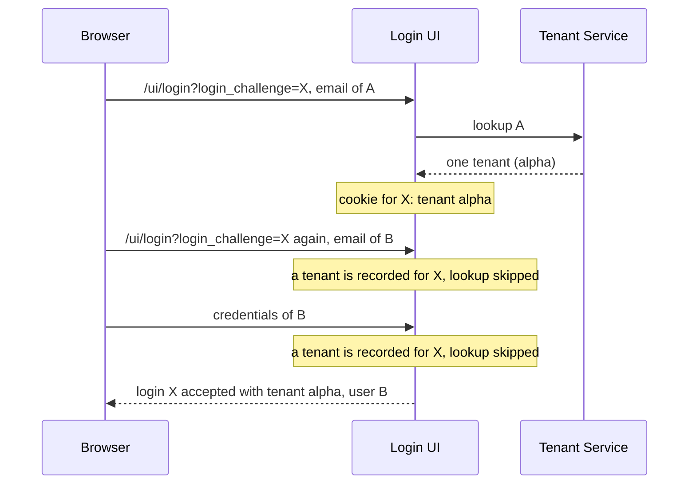

## Context

The state cookie (`internal/cookies` `FlowStateCookie`) holds `TenantID` for the login challenge whose hash it carries. Three places resolve the tenant of a login, all through `CookieTenantResolver` (`pkg/tenants/resolver.go`):

- the email step: `handleUpdateIdentifierFirstFlow` calls `checkTenantSelectionByEmail` (`pkg/kratos/handlers.go`), which looks the email up and writes the cookie;
- after a credential submission: `handleUpdateFlow` calls `NeedsTenantSelection` with the session;
- when the login page is opened with a session: `InterceptLogin` calls `NeedsTenantSelection`.

`handleCreateFlowWithSession` then accepts the Hydra login with the tenant the cookie holds.

Control flow before this change, for two emails in one login request:

Both lookup functions returned early when `TenantID(cookie, challenge)` was not empty. The tenant selection endpoint stores the id the client sends without checking membership; its comment relied on the Tenant Service's hooks for that.

## Goals / Non-Goals

**Goals:**
- The tenant the Login UI accepts a login with is one of the tenants of the user it accepts.
- One function decides, for the email and for the session.

**Non-Goals:**
- A cookie bound to a user. The email step runs before there is a user to bind it to.
- Validating the selection endpoint's input: the resolution before the accept covers it.

## Decisions

### D1: The user's tenants decide, the record only chooses among several

`resolve` takes the tenants just looked up and the cookie. With no tenant it records the no-tenant value; with one, that tenant; with several, it keeps the recorded tenant if it is one of them and otherwise clears the record and asks for a selection. The record is therefore only ever a choice among tenants the user has.

Alternative considered: keep skipping the lookup and bind the record to the email it was made for. The account that signs in is not always the email entered (an external provider), and the selection endpoint has no email.

### D2: The lookup always runs

Skipping it was the defect. The cost is one `LookupTenants` call at each resolution, and a login that fails when the Tenant Service cannot be reached at a step where a record used to be enough.

### D3: An email submission starts from a new cookie

`checkTenantSelectionByEmail` no longer reads the state cookie. With the old record kept, a second user who shares one of several tenants with the first would be given the first user's choice without being asked. The consequence is that a user who selected a tenant and submits their email again selects again.

### D4: The cookie written for the tenant selection is the resolved one

`handleUpdateFlow` wrote the cookie from before the lookup when it sent the user to the tenant selection, so a record that had just been dropped came back. It now writes the cookie `NeedsTenantSelection` returns.

## Risks / Trade-offs

- **The record is not bound to a user.** An account other than the email entered that has the recorded tenant among several keeps it without being asked. → Stated in the spec; the tenant is one of that account's own.
- **The id sent to Kratos with the credentials is the recorded one, unchecked.** → Unchanged; the Tenant Service's login hook is its reader. What the Login UI accepts the Hydra login with is resolved after it.
- **More load on the Tenant Service and one more point of failure per login.** → Accepted for a correct tenant.

## Migration Plan

No migration and no cookie change. A cookie written before the change is resolved by the new rules on its next step.

## Observability

No new metric or log line. A failed lookup is logged as before ("failed to check tenant selection", "failed to evaluate login interception") and answered with 500.

## Failure handling

- The Tenant Service cannot be reached: the step answers 500 and the login is not accepted.
- The tenant list changes between two steps of a login: the later resolution wins.

## Open Questions

None.
