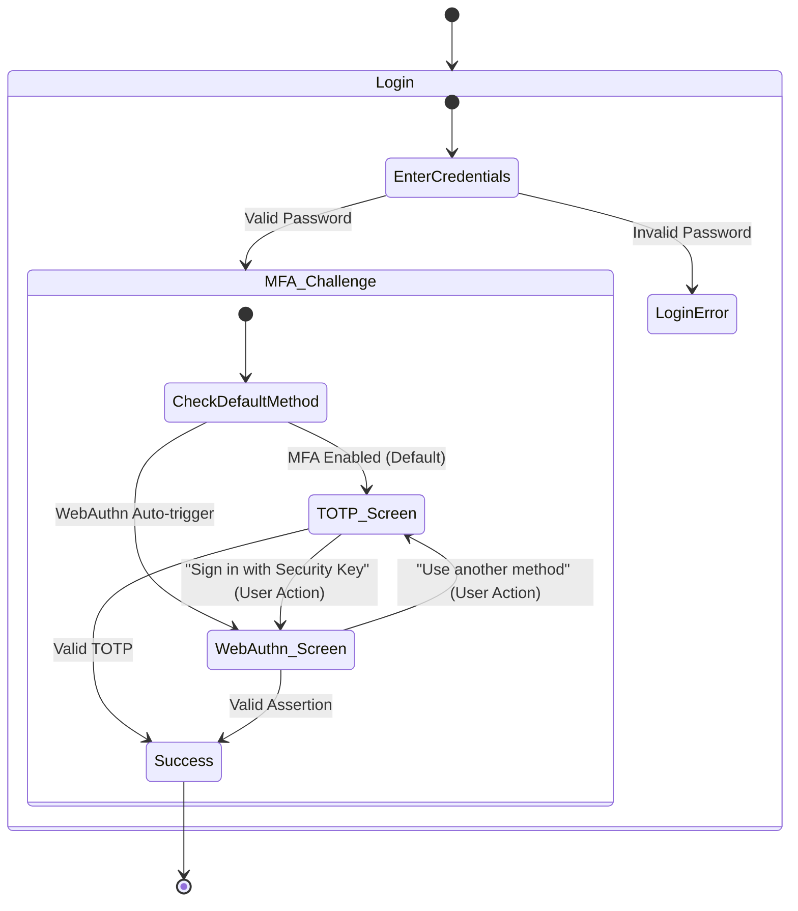
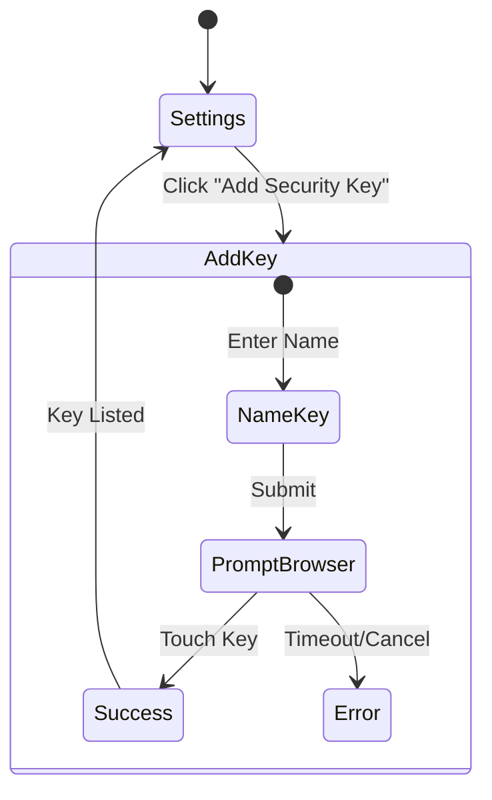

# Identity Platform Login UI - State Diagrams

This document describes the state transitions of the Login UI to assist AI Agents in testing and navigation.

## 1. Standard Login Flow (MFA Enabled)

## 2. 2FA Method Selection Logic

When a user lands on the MFA Challenge page, the UI decides which method to show:

1. **TOTP (Authenticator App)**:
   - Shown by default if `isAuthCode` is true (TOTP nodes exist).
   - *Known Issue*: If TOTP is shown, the "Sign in with Security Key" button might be hidden until manually triggered or fixed.

2. **WebAuthn (Security Key)**:
   - Shown if `isWebauthn` is true.
   - Triggers browser/hardware interaction immediately.

3. **Backup Codes**:
   - Accessed via "Use backup code" or "I cannot access my authenticator" links.

## 3. WebAuthn Registration Flow

